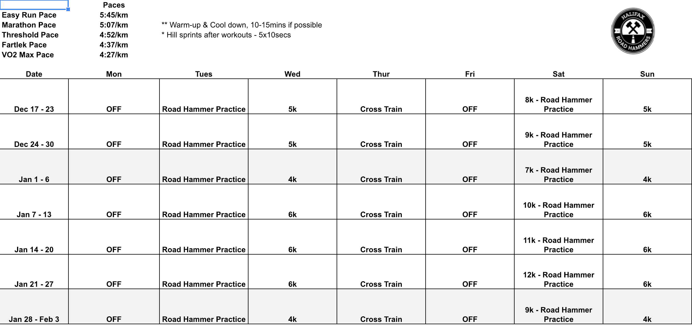
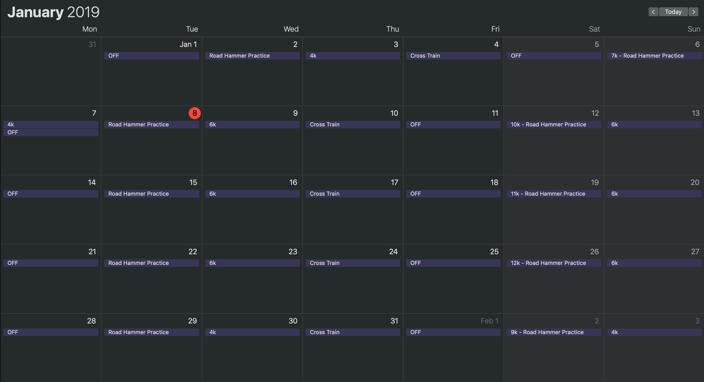

# Running Scheduler

This package converts xlsx spreadsheets from a coach into an iCal file that
you can import for easier viewing.

It will convert from something like

to something you can import into your calendar

## Notes

This is currently pretty limited, it assumes that the input data will look
like the input image.

Could easily be extended to take a range of where the prescribed miles are (e.g. A9:H15)
